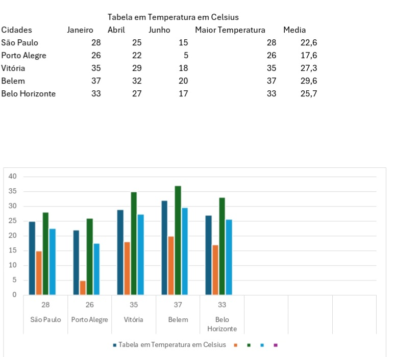

 LOGITECH.docx👋 Hi, I’m @FagPSantos
- Itens pesquisados para o Aprendizado por Projeto Integrador (API)
- Municípios da Região Metropolitana do vale do Paraiba;
- Principais Empresas da Região Metropolitana do Vale do Paraiba;
- Exportação e Importação na Região Metropolitana do Vale do Paraiba;
- Aeroporto de São José dos Campos;
- Cargas com potencial de transporte via modal aéreo.

  Relatório Sprint 1
https://docs.google.com/document/d/1AmRol6xZsHtZ5m1bv4k6zb7-HmuuqM6j/edit.

  Relatório Sprint 2
https://docs.google.com/document/d/1JG9XDcgeM8O-SHX-E24oePUv6AUsmkeR/edit?usp=drivesdk&ouid=105246158924921560733&rtpof=true&sd=true

Relatório Sprint 3.
https://drive.google.com/file/d/1QgxMuGkRDbJQKttz_v_gnec2_th6_DBF/view?usp=drivesdk

Aplicativo Power Apps 
https://drive.google.com/file/d/1QiWOW-GplOqS2UgjJJ0xmErWVt73VRqL/view?usp=drivesdk

Dashboard Power BI 
https://drive.google.com/file/d/1GHyrkXM6VmBhd1IZc0goPieUfVa3ZJkW/view?usp=drivesdk

Exel 
https://docs.google.com/spreadsheets/d/1UAvyj8HZSMtNo5j13lyQzdMhKQyt8Can/edit?usp=drivesdk&ouid=105246158924921560733&rtpof=true&sd=true

